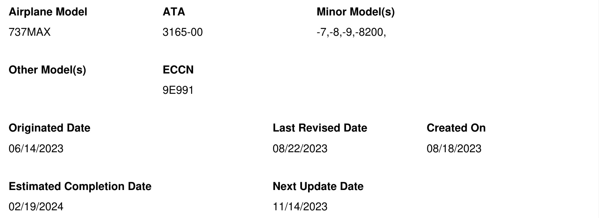

# FLEET TEAM DIGEST  

# 737MAX-FTD-31-23004  

Issue Title : Takeoff Alert Inhibit Option  

  

# Revision Description  

Updated Optional Service Bulletin ECD.  

# Applicability  

All 737MAX Airplanes.  

# Description  

Boeing has determined that there is an issue with Option Selection Software (OSS) parameter OSS_TO_ALERT_INH_800FT.  

# Background  

The Takeoff Alert Inhibit is designed to inhibit the blinking for Engine Alert Messages as described in the Flight Crew Operations Manual (FCOM) Chapter 7 (Engines, APU), Section 10 (Controls and Indicators: Crew Alerts). The Inhibit feature is designed to minimize pilot distractions from 80 knots (kts) up to 400 feet (ft) Radio Altitude (RA) by disabling the OSS parameter above and inhibiting blinking up to 400 ft RA. However, it was determined that the parameter was inverted such that the Inhibit is enabled through 800 ft RA.  

# Note:  

# FLEET TEAM DIGEST  

- The Engine Alert Messages will still annunciate and parent aircraft requirements are still met; requirements do not specify either blinking or inhibiting behavior of crew alerting.  

- This issue was determined not a safety issue.  

# Status  

Boeing will publish a Flight Crew Operations Manual Bulletin (OMB) to reflect the current differences between design and actual behavior.  

Applicable FCOM Volume 2 (V2) systems descriptions are also being amended to reflect these changes targeting a November 23 release.  

The final fix will be available as part of the next MAX Display System (MDS) BlockPoint (BP) release, MDS BP 2.  

Please see 737MAX-FTD-31-23002 for current status and release schedule of MDS BP2 and a list Fleet Team Digest (FTD) articles that are also addressed by the MDS BP 2 release.  

# Interim Action  

Boeing has identified two interim courses of action:  

(1) Operators may continue to fly with the OSS parameter inversion of 800 ft RA.  

If this course of action is chosen, operators should consider proactively communicating with flight crew that blinking of engine alerts will be inhibited at a different range (up to 800 ft RA instead of up to 400 ft RA) than as described in FCOM Chapter 7.10.  

Be aware that the OSS parameter OSS_TO_ALERT_INH_800FT is designed for affected aircraft to inhibit during takeoff from 80 Knots Indicated Airspeed (KIAS) to 400 ft RA as described in the FCOM, or 30 seconds after reaching 80 kts, whichever occurs first; however, the inhibit is currently active up to 800 ft RA, or 30 seconds after reaching 80 kts.  

# FLEET TEAM DIGEST  

(2) An optional Boeing Service Bulletin (SB 737-31-2108) will be available for in-service airplanes flying with MDS OPS (Operational Program Software) SW BP 1.5.1 to revert to the intended 400 ft RA inhibit configuration until the release of MDS BP 2.  

When available, please submit a Service Request via My Boeing Fleet or contact your Field Service Representative and reference PRR 3M9900-100R and/or SB 737-31-2108.  

# Final Action  

When available, incorporate Max Displays System (MDS) BlockPoint (BP) 2 Release, MDS BP 2. This will revert the behavior to the intended 400 ft RA inhibit.  

Please see 737MAX-FTD-31-23002 for current status and release schedule of MDS BP2.  

# Milestones  

Note: Target dates are based upon currently available status and are subject to change.  

Root Cause Established: Completed   
Solution Selected: Completed   
Change Committed: PRR3M9900-100R   
Production Incorporation: See 737MAX-FTD-31-23002   
Optional Service Bulletin 737-31-2108 Available: ECD DEC-2023   
MDS BP2 Service Bulletin 737-31-1929 Available: See 737MAX-FTD-31-23002  

# Related Categories  

Flight Deck Effects and Maintenance Messages - Issue that occurs frequently and causes a flight deck effect or maintenance message • Flight Operations - Flight Operations  