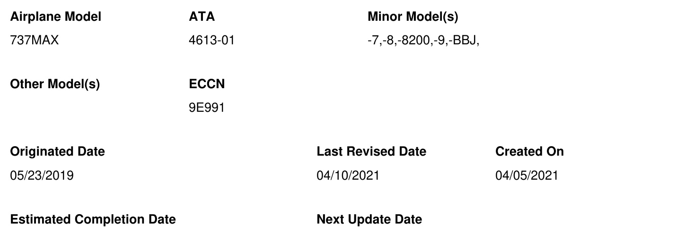
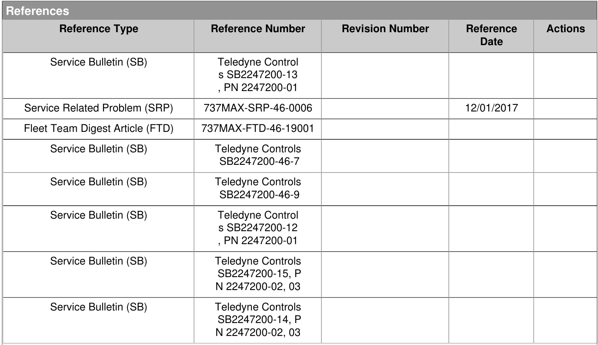
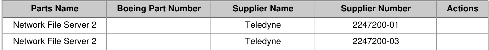

# FLEET TEAM DIGEST（FTD）

737MAX-FTD-46-19002

问题标题：网络文件服务器2（NFS-2）硬件相关问题

# 改版说明

修订了状态部分、最终措施和带有连接器焊点故障日期的里程碑部分。

# 适用性

适用于在下面状态部分提到序号（S/Ns）的737 MAX飞机。

# 描述

737MAX运营商经历了网络文件服务器（NFS）问题。目前，NFS存在两个已知的硬件相关问题：固态硬盘（SSD）和网络扩展设备（NED）子系统处理器（NSP）连接器故障。

## SSD故障症状：

• NFS前面的故障灯在通电后超过10分钟持续亮起。

## SSD故障背景：

• Delkin（SSD供应商）的故障分析未能确定根本原因。
• Delkin试图通过固件更新解决问题，但没有产生积极效果。
主要假设是SSD在写入时容易受到电力中断的影响。

## 连接器焊点故障症状：

典型的故障是A429 ACARS输出（输出#4）性能下降。然而，随着故障模式的进展，这可能成为该输出端口的持续故障。在极端情况下，其他A429和程序引脚可能受到影响。

• 没有通过ARINC通信寻址和报告系统（ACARS）数据链下行的当前航段故障（PLF）和实时事件（RTE）报告。
• 没有通过ACARS数据链向地面下行的CFM LEAP EEC报告。
• 过去10个航段中超过10次的维护消息23-23010（CMU没有从NFS-L接收到客舱终端#1的输入）。
• 不受影响：PLF和故障历史（FH）报告通过无线网络或Gatelink下行到机载软件电子库房（LSAPL）
不受影响：可以通过多功能显示系统（MDS）或维护笔记本电脑访问PLF、FH和驾驶舱的入站影响

## 连接器焊点故障背景：

• 开启了服务相关问题737MAX-SRP-46-0006来调查NSP连接器问题
• 初步调查表明，内部电路卡组件（CCA）连接器承受的力超出了设计。
• 已确定焊点故障的根本原因。

# 状态

## SSD状态：

• Teledyne Controls选择了固态硬盘（SSD）的另一供应商：ATP Electronics。
• ATP Electronics SSD采用更新的技术，具有改进的固件和架构。
• ATP Electronics SSD提供电源保护功能，以确保优雅关机。
• ATP Electronics SSD内置的电源保护功能需要在手动重置期间完全断电。如果使用断路器，请确保拉出至少三秒钟再重新通电。
• Teledyne Controls用ATP Electronics SSD替换返回单位中失败的Delkin SSD。
• 生产单位（从序号47B01090开始）正在交付ATP Electronics SSD。请参阅服务通告以获取适用的序号
• 通过Mod Dot和序号跟踪更换SSD的现场返回。Teledyne Controls服务通告（SB）SB2247200-46-7已发布，适用于NFS P/N 2247200-01，并列出了NFS序号的有效性。
Teledyne计划在2021年第一季度末发布以下服务通告。Teledyne Controls服务通告（SB）SB2247200-46-12已发布，适用于NFS P/N 2247200-01 Teledyne Controls服务通告（SB）SB2247200-46-15已发布，适用于NFS P/N 2247200-03

## 连接器焊点状态：

维护消息23-23010（CMU没有从NFS-L接收到客舱终端#1的输入）对于预测连接器问题有效。
Teledyne进行了故障分析并修改了设计，以机械方式断开网络扩展设备（NED）子系统处理器（NSP）与服务器子系统处理器（SSP）模块组件的连接。
• 已确定根本原因。NSP连接器：NFS中的机械公差叠加和连接器上使用的环氧树脂的不同热膨胀性质导致机械应力，从而导致连接器与印刷线路板之间的焊点断裂。
• Teledyne计划在2021年第一季度末发布以下服务通告。

Teledyne SB SB2247200-46-13取代SB2247200-46-9，并已发布，适用于NFS PN 2247200-01。
Teledyne SB SB2247200-46-14已发布，适用于NFS PN和2247200-03。

# 临时措施

如果NFS显示讨论部分描述的症状，请按照AMM任务46-13-01-000-801（网络文件服务器拆除）拆除NFS，并按照AMM任务46-13-01-400-801（网络文件服务器安装）更换NFS。

# 最终措施

Boeing建议航空公司运营商将故障的NFS单位送回Teledyne Controls进行修理。

已确定根本原因。在NSP连接器上，NFS中的机械公差叠加和连接器上使用的环氧树脂的不同热膨胀性质导致机械应力，从而导致连接器与印刷线路板之间的焊点断裂。

实施Teledyne SB SB2247200-46-13，适用于NFS PN 2247200-01，和Teledyne SB SB2247200-46-14，适用于NFS PN 2247200-03。

关闭此 FTD

# 里程碑

注意：目标日期基于当前可用状态，并有未来修订的风险。

NFS2 SSD更换
根本原因确定：2019年3月
解决方案选择：2019年3月
更改承诺：2019年3月
服务通告可用：Teledyne Controls服务通告（SB）SB2247200-46-12已发布，适用于NFS P/N
2247200-01
Teledyne Controls服务通告（SB）SB2247200-46-15已发布，适用于NFS P/N 2247200-03
部件可用：2021年3月18日
Boeing服务信函：737-SL-46-039-A（已发布）

连接器焊点问题根本原因确定：2020年10月 解决方案选择：2020年12月 更改承诺：2021年第一季度 服务通告可用：2021年3月19日。

Teledyne SB SB2247200-46-13将发布，适用于NFS PN 2247200-01。
Teledyne SB SB2247200-46-14将发布，适用于NFS PN 2247200-02和2247200-03。部件可用：2021年3月18日
Boeing服务信函：737-SL-46-043（已发布）

# 部件清单

# 相关类别

• 组件问题 - 在组件维护期间发生的问题或对组件可靠性有影响的问题 • 放行可靠性问题 - 导致收入航班延误和取消的问题 • 机队团队IdeaXchange - 机队团队IdeaXchange公告板上的讨论主题