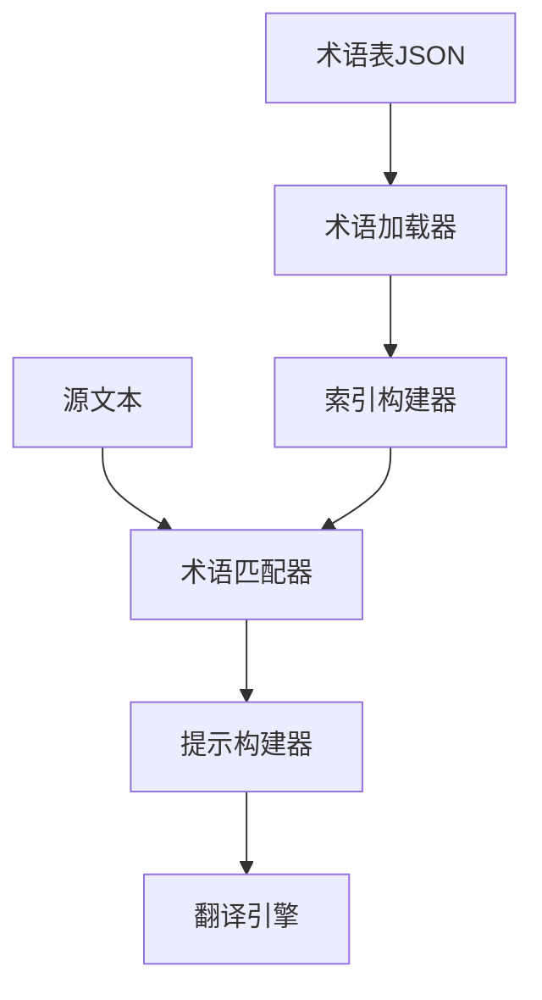

# Translation Agent 项目架构

## 2024-03-28 系统架构更新

### 1. 核心组件
- 翻译引擎
  - 基于 OpenAI GPT 模型
  - 支持单模型和双模型翻译模式
  - 可配置的翻译参数（温度、最大令牌数等）
- 文件处理系统
  - PDF 文档处理
  - DOCX 文档处理
  - 文本预处理和清理
- 用户界面系统
  - Gradio 构建的交互界面
  - 动态模型配置
  - 语言切换功能

### 2. 项目结构
```
translation-agent/
├── app/                # 主应用程序代码
│   ├── app.py         # 主应用逻辑和界面
│   ├── process.py     # 文本处理功能
│   └── patch.py       # 补丁和修复功能
├── examples/           # 示例代码
├── tests/             # 测试用例
├── .env               # 环境变量配置
├── pyproject.toml     # Poetry 项目配置
└── poetry.lock        # 依赖版本锁定
```

### 3. 工作流程
1. 输入处理
   - 文本直接输入
   - 文档文件导入（PDF/DOCX）
2. 翻译处理
   - 单模型模式：直接翻译
   - 双模型模式：翻译+优化
3. 输出处理
   - 结果展示
   - 文本导出
   - 差异对比

### 4. 依赖管理
- Poetry 包管理
- 虚拟环境隔离
- 版本控制
- 环境变量配置

# 系统架构文档

## 术语系统架构 (2024-02-13更新)

### 核心组件
1. 术语管理模块 (`glossary_utils.py`)
   - 术语加载器：负责读取和解析术语表文件
   - 索引构建器：创建高效的术语检索索引
   - 术语匹配器：实现智能术语查找算法

2. 翻译核心模块 (`core.py`)
   - 翻译协调器：整合术语和翻译流程
   - 提示构建器：生成优化的翻译提示

### 数据流程


### 性能特性
| 功能 | 性能指标 | 说明 |
|------|---------|------|
| 术语加载 | <100ms | 首次加载万级术语表 |
| 索引查询 | <1ms | 单次术语匹配耗时 |
| 内存占用 | ~1MB/万条 | 优化后的索引结构 |

### 优化策略
1. 缓存机制
   - 术语表缓存：避免重复加载
   - 索引缓存：提高查询效率
   - 文件监控：自动更新缓存

2. 智能匹配
   - 长度优先：优先匹配较长术语
   - 上下文感知：考虑术语使用场景
   - 动态筛选：仅处理相关术语 